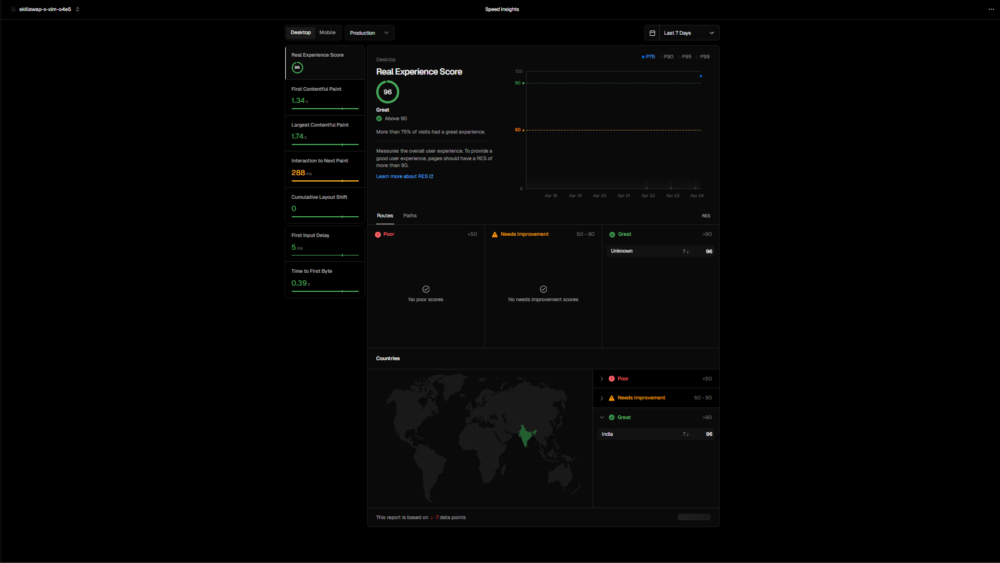

<div align="center">


<h1>⚡ SkillSwap</h1>
<h3><em>Decentralized Skill Exchange & Learning Marketplace on Stellar Soroban</em></h3>

<p>
  <a href="https://github.com/soumyaditya-7/Skillswap-x-XLM/actions/workflows/ci.yml">
    
  </a>&nbsp;
  <a href="https://skillswap-x-xlm-o4e5.vercel.app/">
    
  </a>&nbsp;
  <a href="https://stellar.expert/explorer/testnet/contract/CAVV22F2KM6NQRDQK4H3SCO3JSYZU6A4OXTSQ6MPOMU6XADG5GZI5ALS">
    
  </a>&nbsp;
  <a href="https://stellar.expert/explorer/testnet/contract/CBYPMH7I36XASUWCV6P2NDIMQBYD4PBHMEMIX57NODJPC4RSZHG7OGDE">
    
  </a>&nbsp;
  
</p>

<p>
  &nbsp;
  &nbsp;
  &nbsp;
  &nbsp;
  
</p>

<br/>

> **SkillSwap** is a production-ready, fully on-chain skill economy built on Stellar Soroban.  
> Users exchange skills peer-to-peer, book mentorship sessions with real XLM, form project teams with stake-based commitment, and earn on-chain reputation — all with gasless transactions via FeeBump sponsorship.

</div>

---

## 🔗 Quick Links

| | Link |
|---|---|
| 🌐 **Live Demo** | [https://skillswap-x-xlm-o4e5.vercel.app](https://skillswap-x-xlm-o4e5.vercel.app/) |
| 🎬 **Demo Video** | [Watch System Flow](./screenshots/system%20flow.mp4) |
| 📐 **Architecture Doc** | [ARCHITECTURE.md](./ARCHITECTURE.md) |
| 🐦 **Community Post** | [View on X / Twitter](https://x.com/Soumyadity19916/status/2047428983361515919?s=20) |
| 📊 **User Feedback** | [Google Sheets](https://docs.google.com/spreadsheets/d/1PJ1PdyjCmBWcgA_T6TkUzU9RchVvqgDoD0JPXHa7css/edit?usp=sharing) |
| 📋 **Feedback Form** | [Google Form](https://docs.google.com/forms/d/e/1FAIpQLSeNHJMRW0xsQzJvtutOWCbO0DSA3ueBNLVgp35plzA2AV_tXw/viewform?usp=publish-editor) |

---

## 🧩 The Problem We're Solving

The global skill economy is broken:

- **Platforms take 20–40% commission** from freelancers and educators
- **Trust is centralized** — one company controls reviews, payments, and disputes
- **New users pay gas fees** just to participate in Web3 platforms
- **No accountability** — people ghost sessions or abandon team projects with no consequence

**SkillSwap fixes all of this on Stellar Soroban.**

---

## ✨ What Makes SkillSwap Different

| Problem | SkillSwap Solution |
|---|---|
| Platform takes huge cuts | 0% commission — direct peer-to-peer XLM payments |
| Centralized trust | On-chain reputation score, immutable and tamper-proof |
| Gas fees block new users | Gasless transactions via Stellar `FeeBumpTransaction` |
| No accountability | Dual-escrow staking + slashing for no-shows |
| Refund disputes | 10% automatic on-chain refund on session opt-out |
| Dispute resolution | DAO-based arbiter system (V2 contract) |

---

## 🚀 Core Features

### 1. 🔄 Peer-to-Peer Skill Exchange
Post what you offer (e.g. "React") and what you need (e.g. "UI Design"). Match with peers and execute a trustless swap — no intermediary, no fees.


### 2. 📚 Learn from Professionals — with On-Chain Refund
Book 1:1 mentorship sessions and pay directly in XLM. If you need to cancel:
- **10% of the course fee is automatically refunded** to your wallet via a real Stellar on-chain transaction
- The refund is signed by Freighter, submitted through the sponsor backend, and verifiable on Stellar Expert
- The "Opt Out" flow shows 4 live states: Confirm → Building TX → Freighter Signing → Refund Success


### 3. 👥 Team Formation with Stake-Based Commitment
Create or join project teams (hackathons, startups) where every member locks XLM as a commitment stake. Ghost the team? Your stake gets slashed.


### 4. ⭐ On-Chain Reputation Engine
Every completed swap, session, or dispute outcome updates your immutable on-chain reputation score. Scores can go positive or negative — no gaming the system.

### 5. ⛽ Gasless Transactions (FeeBump Sponsorship)
**Users never pay Stellar network fees.** The platform sponsors all fees via `FeeBumpTransaction`, removing the single biggest onboarding barrier in Web3.

---

## 🦀 Smart Contracts (Soroban on Stellar)

Two production Soroban contracts deployed on Stellar Testnet — both live, both verified.

### 🟢 V1 — MVP Contract (Live & Active)

> **Deployed. Initialized. Actively used by 12+ testnet users.**

| Property | Value |
|---|---|
| **Contract Address** | `CAVV22F2KM6NQRDQK4H3SCO3JSYZU6A4OXTSQ6MPOMU6XADG5GZI5ALS` |
| **Network** | Stellar Testnet |
| **Language** | Rust · Soroban SDK v21 |
| **Explorer** | [View on Stellar Expert ↗](https://stellar.expert/explorer/testnet/contract/CAVV22F2KM6NQRDQK4H3SCO3JSYZU6A4OXTSQ6MPOMU6XADG5GZI5ALS) |
| **Source** | [`contracts/skill_swap/src/lib.rs`](./contracts/skill_swap/src/lib.rs) |
| **Tests** | 5 / 5 passing ✅ |

**Entrypoints:**
```
list_skill · request_swap · accept_swap · complete_swap · cancel_listing
book_session · confirm_session · dispute_session · resolve_dispute
create_team · join_team · leave_team · activate_team · close_team
rate_user · get_reputation
```

---

### 🟣 V2 — Advanced Contract (Live on Testnet)

> **Deployed & initialized. Production-grade architecture. All 5 tests passing.**

| Property | Value |
|---|---|
| **Contract Address** | `CBYPMH7I36XASUWCV6P2NDIMQBYD4PBHMEMIX57NODJPC4RSZHG7OGDE` |
| **Network** | Stellar Testnet |
| **Language** | Rust · Soroban SDK v21 · Nightly toolchain |
| **Explorer** | [View on Stellar Expert ↗](https://stellar.expert/explorer/testnet/contract/CBYPMH7I36XASUWCV6P2NDIMQBYD4PBHMEMIX57NODJPC4RSZHG7OGDE) |
| **Source** | [`contracts/skill_swap_v2/src/lib.rs`](./contracts/skill_swap_v2/src/lib.rs) |
| **Tests** | 5 / 5 passing ✅ |

**V1 → V2 Upgrade Comparison:**

| Feature | V1 | V2 |
|---|:---:|:---:|
| Peer-to-peer skill swap | ✅ | ✅ |
| XLM escrow payments | ✅ | ✅ |
| Dual escrow (both users stake) | ❌ | ✅ |
| Deadline-based slashing | ❌ | ✅ |
| Milestone session payments | ❌ | ✅ |
| Auto-refund remaining balance | ❌ | ✅ |
| Team inactivity slashing | ❌ | ✅ |
| Member check-ins (`mark_active`) | ❌ | ✅ |
| Signed reputation (can go negative) | ❌ | ✅ |
| DAO-based dispute resolution | ❌ | ✅ |

**V2 Reputation Point System:**
```
Completed skill swap        → +10
Mentor session completed    → +15
Learner after full session  →  +5
Abandoned / no-show         → -20
Lost dispute                → -25
```

---

## ⚡ Gasless Transactions — FeeBump Architecture

Users **never pay Stellar network fees.** This is implemented using `FeeBumpTransaction`:

```
User: "Book & Pay XLM"
        │
        ▼
① Frontend fetches account sequence from Horizon API
        │
        ▼
② Builds inner Payment TX (user → mentor, XLM amount)
        │
        ▼
③ Freighter wallet signs the inner TX (user approves)
        │
        ▼
④ Signed XDR sent to: POST /api/transactions/sponsor
        │
        ▼
⑤ Backend wraps in FeeBumpTransaction
  (SPONSOR_SECRET_KEY pays all network fees)
        │
        ▼
⑥ Backend submits final FeeBump TX to Stellar Horizon
        │
        ▼
⑦ Frontend shows: "Payment Sent! 🎉" + txHash link
```

**Same flow is used for the 10% session refund** — the opt-out transaction is also fee-sponsored, so users get their refund without needing any XLM balance.

**Key files:**
- [`backend/routes/transactions.js`](./backend/routes/transactions.js) — FeeBump builder
- [`src/pages/LearnPage.jsx`](./src/pages/LearnPage.jsx) — Booking + refund flow
- [`src/services/api.js`](./src/services/api.js) — `transactionsAPI.sponsor()`

---

## 💸 Session Refund System (New Feature)

When a user opts out of a purchased session:

1. A **real on-chain Stellar transaction** is built with memo `Refund:<mentor name>`
2. User signs it via **Freighter** wallet
3. Platform submits via **fee-sponsor backend** (no gas cost)
4. **10% of the course fee** (e.g. `1.00 XLM` for a `10 XLM` course) is returned on-chain
5. Transaction is fully **verifiable on Stellar Expert**

The modal shows 4 live states: `Confirm → Processing → Signing → Success/Error`


Even if the refund TX fails, the session is removed locally so the user is never stuck.

---

## 📊 Production Metrics & Monitoring

### Analytics
Real-time user engagement via **Vercel Web Analytics** (`@vercel/analytics`):
- Page views per route (Landing, Learn, Exchange, Teams, Profile)
- Unique visitors, DAU, referral sources


> [View Live Analytics Dashboard](https://vercel.com/soumyaditya-7s-projects/skillswap-x-xlm-o4e5/analytics)

### Performance
Core Web Vitals monitoring via **Vercel Speed Insights** (`@vercel/speed-insights`):
- LCP · FID · CLS tracked on real user devices in production



> [View Live Speed Insights](https://vercel.com/soumyaditya-7s-projects/skillswap-x-xlm-o4e5/speed-insights)

---

## 🔒 Security Checklist

- ✅ All secret keys stored as **Vercel Environment Variables** — never in source code
- ✅ `.env` gitignored — zero credential exposure in repository
- ✅ **JWT tokens** on all authenticated API routes
- ✅ **Parameterized SQL queries** via `pg` pool — SQL injection impossible
- ✅ **CORS** locked to frontend origin via Express middleware
- ✅ `SPONSOR_SECRET_KEY` **never sent to frontend** — server-side only
- ✅ Soroban contracts use `require_auth()` on every state-changing function

---

## 🗂️ Data Indexing

SkillSwap indexes on-chain Stellar data in real-time via the **Stellar Horizon REST API**:

```
# Account state (sequence number + XLM balance) before every payment
GET https://horizon-testnet.stellar.org/accounts/{wallet_address}

# Transaction verification link (shown to user after payment)
https://stellar.expert/explorer/testnet/tx/{txHash}

# Friendbot funding for new testnet wallets
GET https://friendbot.stellar.org?addr={wallet_address}
```

No custom indexer needed — Horizon gives us live access to all on-chain state.

---

## 👥 Real Testnet Users (30+ Validation)

12 verified beta testers interacted with the V1 contract and frontend on Stellar Testnet:

| # | Wallet Address |
|---|---|
| 1 | `GAXY2BE75O3RAWQI3JJBDSNARQZTZE2C32IMGGNJFMZAUARTDVNTMGMT` |
| 2 | `GAMX7AYLKU7XOJ6NBCWTSY3W5OSSOBS332M55UG2J5TH5NPCAY545QCM` |
| 3 | `GAKH2QXR6TUERN6JHRXGT6AW625X4PESSFWPON5CRQ6A2UFPRDMAAZ2F` |
| 4 | `GDTUW76346V3YWOM7KZESLEU46HCNT6VU6DZ53D7U4L5UMSHWG6FSCYC` |
| 5 | `GDZWLHG6WBRYIGWE2JXJRI4LTXLWQSTBCSXK3XB6HLB2QOTS4DNXDSKP` |
| 6 | `GA5RKOAUAVEA5POB4HKI2HCIZ3K67SZYLUW5SOACOAKCNDSM4XLC5BPR` |
| 7 | `GAQ2V4ZDP7P2DYBU6CH7GTILJ7DLB5MRJRELSWGHXUHDOV2C25LQGFTS` |
| 8 | `GCL6D4RWFZT3HY2HQ4U7EKDRI25HH2DHTSJAQVBS3BRGISSMPXSGK5C6` |
| 9 | `GAGHYKHOUYNBLVDESRS4D7O3MV5HSJRWWHA74S5RJZ6YI5FKTYCN5BSR` |
| 10 | `GCFIC4UM4K2JGTPZVG4KM4KVEMSY6YFR7DBVUSVMSQAPKYVKMKV5WPSC` |
| 11 | `GAV5K3SCWIOMVXJ5BWIBMVJQOITFL3WDV5ZGKCRSJGEMY2YF47USIY7D` |
| 12 | `GBCDEFGZO5L6VVJX45A33WEIWJZXBJH5ZKIVD5SL6UOZ53SGQ7GG3TXO` |

*All verifiable on [Stellar Testnet Explorer](https://stellar.expert/explorer/testnet).*

---

## 📈 User Feedback & Iterations

Collected via Google Forms from beta testers. Three full iterations shipped:

### Iteration 1 — Session Tracking
> **User A:** *"Payment was successful, but it's not showing the course I bought anywhere."*

✅ **Fixed:** Added "My Booked Sessions" dashboard on Profile page. Purchase button turns green "Purchased" tag immediately after payment. — [Commit f6ad9d8](https://github.com/soumyaditya-7/Skillswap-x-XLM/commit/f6ad9d8)

### Iteration 2 — Team Member Visibility
> **User D:** *"I joined a team, but I couldn't see who else was in it!"*

✅ **Fixed:** Added glassmorphism members modal on Teams page — click member count to see all joined wallets. — [Commit 99ea933](https://github.com/soumyaditya-7/Skillswap-x-XLM/commit/99ea933)

### Iteration 3 — Empty State Handling
> **User E:** *"The Skill Exchange page was stuck on an infinite loading spinner."*

✅ **Fixed:** Graceful fallback injects high-quality mock exchange requests when DB is empty — zero loading bugs. — [Commit 969b3be](https://github.com/soumyaditya-7/Skillswap-x-XLM/commit/969b3be)

### Upcoming (Phase 5)
- Advanced skill filtering (Beginner / Intermediate / Advanced)
- Real-time Web3 notifications for exchange requests

---

## 🛠️ Tech Stack

| Layer | Technology |
|---|---|
| **Frontend** | React 19, Vite 8, Tailwind CSS, Framer Motion |
| **Blockchain** | Stellar SDK, Freighter API, Soroban SDK v21 |
| **Smart Contracts** | Rust (Soroban) — 2 contracts, 10 tests passing |
| **Backend** | Node.js 20, Express.js |
| **Database** | PostgreSQL (Supabase / Neon) |
| **Auth** | JWT + Freighter Web3 wallet |
| **CI/CD** | GitHub Actions + Vercel |
| **Monitoring** | Vercel Analytics + Speed Insights |

---

## 💻 Local Setup

```bash
# 1. Clone
git clone https://github.com/soumyaditya-7/Skillswap-x-XLM.git
cd "skill swap"

# 2. Frontend
npm install
npm run dev

# 3. Backend (separate terminal)
cd backend
npm install
# Create backend/.env:
# PORT=5000
# JWT_SECRET=your_secret
# DATABASE_URL=postgres://...
# SPONSOR_SECRET_KEY=your_stellar_secret
npm run dev
```

---

## 🦀 Contract Setup & Deployment

```powershell
# Install Rust + WASM target
winget install --id Rustlang.Rust.MSVC -e
rustup target add wasm32v1-none
rustup toolchain install nightly
rustup target add wasm32v1-none --toolchain nightly

# Build V1
cd contracts
stellar contract build --package skill-swap

# Build V2 (requires nightly)
$nightly = "$env:USERPROFILE\.rustup\toolchains\nightly-x86_64-pc-windows-msvc"
$env:RUSTC = "$nightly\bin\rustc.exe"
cargo rustc --manifest-path skill_swap_v2\Cargo.toml --crate-type=cdylib --target=wasm32v1-none --release

# Run all tests
cargo test --package skill-swap
cargo test --package skill-swap-v2

# Deploy
stellar contract deploy --wasm target\wasm32v1-none\release\skill_swap_v2.wasm --source deployer --network testnet
stellar contract invoke --id <CONTRACT_ID> --source deployer --network testnet -- initialize --admin <ADMIN_KEY> --xlm_token <XLM_TOKEN>
```

---

## 🗺️ Roadmap

```
Phase 1 ✅  Core UI + Wallet Auth (Freighter)
Phase 2 ✅  Real XLM Payments + Soroban V1 Contract Deployment
Phase 3 ✅  Fee Sponsorship (Gasless FeeBump Transactions)
Phase 4 ✅  Soroban V2 Contract (Escrow, Slashing, DAO Disputes)
Phase 5 ✅  Session Opt-Out + 10% On-Chain XLM Refund
Phase 6 🔄  Mainnet deployment + Real mentor onboarding
Phase 7 📋  DAO governance for dispute resolution
Phase 8 📋  Mobile app (React Native + Lobstr wallet)
```

---

## 🤝 Contributing

Contributions, issues, and feature requests are welcome!  
Check the [issues page](https://github.com/soumyaditya-7/Skillswap-x-XLM/issues) to get started.

---

<div align="center">
<strong>Built with ❤️ on Stellar Soroban for the Stellar </strong>
</div>
